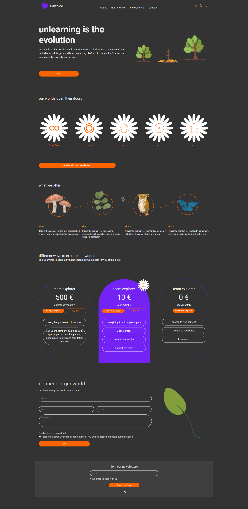

# larger.world Hackathon

## Project Overview

In August 2024, we participated in a 48-hour hackathon as a team of four, where we developed a single-page application (SPA) using React.js. The primary goal of our project was to create an engaging and user-friendly interface that showcases the client's desire for a primary focus on working with small cases and maintaining minimalistic interfaces. By prioritizing simplicity and functionality, we aimed to provide users with a seamless experience that aligns with their needs.

## Technologies Used

- **Frontend:**
  - 
  - 
  - 
- **Version Control:**

  - 
  - 

- **Other Tools:**
  - 

## Key Features

- Implemented several static pages utilizing React.js and Material-UI, ensuring a aesthetically pleasing user experience.
- Developed horizontal scroll page.
- Created a seamless navigation experience across the application with optimized routing.

## Development Process

- **Collaboration:** Worked effectively with team members to divide tasks and leverage each other's strengths, ensuring that we met our project goals within the tight 48-hour timeframe.
- **Project Management:** Managed timelines and responsibilities, facilitating regular check-ins and updates to maintain project alignment and momentum.
- **Version Control:** Utilized Git and GitLab for version control, which streamlined our workflow, minimized conflicts, and ensured all team members were consistently aligned throughout the development process.

## Challenges Faced

- **Time Constraints:** Due to the 48-hour time limit, we faced challenges in structuring the full codebase and implementing additional features. As a result, we were unable to add more animations and pages than we had initially planned.
- **Complexity of Features:** Some features proved to be more complex than anticipated. We had to prioritize essential features over others to meet the deadline.
- **Coordination Among Team Members:** While collaboration was effective, ensuring constant alignment on tasks and progress required clear communication, especially as we juggled multiple responsibilities in a short timeframe.

## Lessons Learned

- Gained valuable experience in rapid development and teamwork in a high-pressure environment.
- Enhanced skills in version control and collaborative coding practices.

## Screenshot



## Installation

To run the project locally, follow these steps:

Clone the repository:

```bash
git clone https://github.com/Klimentina2709/larger-world.git

# Install the dependencies:
npm install

# Start the application:
npm run dev

# The app should now be running on
http://localhost:5173.

```

## Contact

If you have some questions, feel free to contact me.
